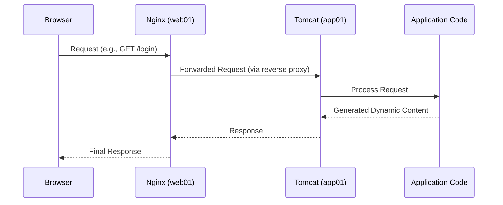

# Chapter 2: Web Serving & Application Deployment (Nginx/Tomcat)

Welcome back! In the previous chapter, [Local Development Environment (Vagrant)](01_local_development_environment__vagrant__.md), we set up our virtual workspace using Vagrant, giving us dedicated virtual machines (VMs) for different parts of the `vpro_project` like the database, application, and web server. You learned how to bring this environment online with a simple `vagrant up` command.

Now that our virtual computers are running, how does a user actually *interact* with our application? When someone types a web address into their browser, how does that request find its way to the right code and get a response back?

This is where **Web Serving** and **Application Deployment** come in, using tools like **Nginx** and **Tomcat** within our Vagrant environment.

Imagine your web application is like a business. The "front door" that welcomes customers is the web server (Nginx). It's good at handling lots of people at once and showing them basic information quickly (like signs and brochures - static content). For more complex requests (like asking a question or buying something - dynamic requests), the web server directs them to the "back office" or "factory" where the actual work happens (the application server, Tomcat, running your code).

**The problem:** How do we efficiently handle incoming web requests from users and run our Java application code to generate dynamic responses in a structured and secure way within our multi-VM setup?

**The solution (for this project): Nginx as a Web Server and Reverse Proxy, and Tomcat as an Application Server running our WAR file.**

## What Happens When You Visit a Website?

Let's trace a simple request, like visiting `http://web01/`.

1.  Your browser looks up the name `web01`. Thanks to Vagrant and the Hostmanager plugin we saw in [Chapter 1](01_local_development_environment__vagrant__.md), your computer knows that `web01` is the hostname for the VM with the private IP `192.168.56.11`.
2.  Your browser sends a request (like "GET /") to `192.168.56.11`.
3.  This request arrives at the `web01` VM.
4.  Running on `web01` is a piece of software called **Nginx**. Nginx receives the request.
5.  Nginx decides what to do with the request. Based on its configuration, it might:
    *   Serve a simple file directly from `web01`'s disk (like an HTML page or an image). This is **static content**.
    *   Forward the request to another server to handle. This is acting as a **Reverse Proxy**. In our case, it forwards dynamic requests to the **Tomcat** server running on the `app01` VM.
6.  The request arrives at the `app01` VM, where **Tomcat** is running.
7.  Tomcat receives the request and figures out which part of the deployed application code should handle it.
8.  The application code runs, potentially interacting with other services like the database ([Data Persistence Layer (JPA/Hibernate)](04_data_persistence_layer__jpa_hibernate__.md)), cache ([Caching Mechanism (Memcached)](05_caching_mechanism__memcached__.md)), or message queue ([Messaging Queue (RabbitMQ)](06_messaging_queue__rabbitmq__.md)).
9.  The application code generates a dynamic response (like a personalized web page).
10. Tomcat sends this response back to Nginx on `web01`.
11. Nginx receives the response from Tomcat and sends it back to your browser.
12. Your browser displays the web page.

This whole process, especially steps 4-11, is what this chapter is about!

## Key Concepts

Let's break down the main players:

| Concept                 | What it is                                        | Role in `vpro_project`                                   | VM Location |
| :---------------------- | :------------------------------------------------ | :------------------------------------------------------- | :---------- |
| **User Request**        | What the browser sends (e.g., asking for a page). | Starts the whole process.                                | N/A         |
| **Web Server (Nginx)**  | Software handling incoming web requests.          | Serves static files; forwards dynamic requests. Acts as the public-facing entry point. | `web01`     |
| **Application Server (Tomcat)** | Software running dynamic application code.        | Runs the Java application code packaged as a WAR file.     | `app01`     |
| **Static Content**      | Files that don't change (HTML, CSS, images).      | Primarily served directly by Nginx for speed.            | `web01`     |
| **Dynamic Content**     | Content generated by the application code (e.g., results page). | Handled by Tomcat, generated by the application.         | `app01`     |
| **Reverse Proxy**       | A server that forwards requests to other servers.   | Nginx forwards requests from the internet to Tomcat.     | `web01`     |
| **WAR File**            | A standard way to package Java web applications.  | Contains all the application code, libraries, and resources. | Deployed *inside* Tomcat on `app01`. |

## How it Works in `vpro_project`

Let's look at how our Vagrant setup reflects this architecture. From the `Vagrantfile` in [Chapter 1](01_local_development_environment__vagrant__.md), we have:

```ruby
# ... other VM definitions ...

### tomcat vm ###
   config.vm.define "app01" do |app01|
    app01.vm.box = "centos/stream9"
    app01.vm.hostname = "app01"
    app01.vm.network "private_network", ip: "192.168.56.12" # Tomcat VM IP
    # ... provider settings ...
   end


### Nginx VM ###
  config.vm.define "web01" do |web01|
    web01.vm.box = "ubuntu/jammy64"
    web01.vm.hostname = "web01"
  web01.vm.network "private_network", ip: "192.168.56.11" # Nginx VM IP
  # ... provider settings ...
end
# ... end of Vagrantfile ...
```

*   The `web01` VM (`192.168.56.11`) runs **Nginx**. This is the first point of contact for external requests (or requests from your host machine via the private network).
*   The `app01` VM (`192.168.56.12`) runs **Tomcat**. This server hosts the actual application code.

Nginx on `web01` is configured to listen for incoming web requests. If a request is for something like `/images/logo.png` or `/styles/main.css`, Nginx will serve that file directly from a directory on the `web01` VM, which is very fast.

If a request is for a dynamic page, like `/user/profile` or `/login`, Nginx is configured to act as a **reverse proxy**. It doesn't handle the request itself but instead forwards it internally to the Tomcat server running on `app01` (at `192.168.56.12`, usually on port 8080).

Tomcat on `app01` is set up to receive these forwarded requests. Your application code is packaged into a **WAR file**.

### What is a WAR File?

A **W**eb application **AR**chive (WAR) file is like a zip file that contains everything needed for a Java web application: Java classes, libraries (JAR files), HTML pages, CSS, JavaScript, configuration files, etc. It has a specific directory structure that web servers and servlet containers (like Tomcat) understand.

You can see in the project's `pom.xml` file (which manages the project's build process using Maven) that it's configured to create a WAR file:

```xml
<?xml version="1.0" encoding="UTF-8"?>
<project xmlns="http://maven.apache.org/POM/4.0.0"
         xmlns:xsi="http://www.w3.org/2001/XMLSchema-instance"
         xsi:schemaLocation="http://maven.apache.org/POM/4.0.0 http://maven.apache.org/xsd/maven-4.0.0.xsd">
    <!-- ... other project details ... -->
    <artifactId>vpro</artifactId>
    <packaging>war</packaging> <!-- This line says "package as a WAR file" -->
    <version>v2</version>
    <!-- ... rest of the file ... -->
</project>
```
The `<packaging>war</packaging>` line tells Maven to bundle the project's output into a `.war` file (e.g., `vpro.war`). This file is then deployed to the Tomcat server on the `app01` VM. Tomcat "unpacks" the WAR file and runs the application within it.

### The Request Flow Illustrated

Here's a simple sequence of how a dynamic request travels:


This diagram shows the path for a dynamic request. Nginx receives it, passes it to Tomcat, Tomcat runs the relevant code, gets the result, and sends it back through Nginx to the browser.

## Under the Hood: Nginx as Reverse Proxy

Why do we use Nginx in front of Tomcat?

1.  **Serving Static Content Faster:** Nginx is highly optimized for serving static files. It can handle many simultaneous connections efficiently.
2.  **Load Balancing:** If we had multiple `app` VMs running Tomcat, Nginx could distribute incoming requests among them, preventing any single server from getting overloaded. (In our current setup, it's just one `app01`, but the architecture supports scaling).
3.  **Security:** Nginx can act as a buffer, handling SSL/TLS encryption (making your site `https`) before requests even reach Tomcat. It can also help filter malicious requests.
4.  **Compression and Caching:** Nginx can compress responses and cache static files more effectively than Tomcat alone.
5.  **Single Entry Point:** Users only need to know the address of `web01`. Nginx handles the routing to the correct internal service (`app01`, `db01`, etc. - though Nginx primarily interacts with `app01` for dynamic requests).

The actual Nginx configuration on `web01` would contain rules telling it which URLs (`locations`) to serve statically and which to `proxy_pass` to `app01:8080`.

For example, a simplified Nginx configuration snippet might look conceptually like this (the actual config files on the VM handle the details):

```nginx
server {
    listen 80; # Listen for incoming HTTP requests on port 80

    location /static/ {
        # If the URL starts with /static/, serve files from this directory
        alias /var/www/vpro_static/;
    }

    location / {
        # For all other requests, forward them to the Tomcat server
        proxy_pass http://app01:8080;
        # Some other proxy settings might be here...
    }
}
```
This conceptual example shows how Nginx separates handling of requests based on the URL path, sending dynamic requests to Tomcat. `app01:8080` refers to the hostname `app01` (which resolves to `192.168.56.12` via the private network and Hostmanager) and Tomcat's default HTTP port (8080).

## Deploying the Application

Once your `vpro.war` file is built (e.g., using `mvn package` with Maven), you would typically deploy it to Tomcat on the `app01` VM. In a development environment managed by Vagrant, this deployment might be automated by provisioning scripts that run when you do `vagrant up`. These scripts would copy the WAR file to a specific directory that Tomcat monitors (like `webapps/`) and Tomcat would automatically deploy it.

The details of the deployment script aren't covered in this chapter, but the result is that your application code becomes accessible and runnable within the Tomcat server.

## Conclusion

In this chapter, you've learned how the `vpro_project` handles incoming web requests. You now understand the roles of **Nginx** (running on `web01`) as a fast web server for **static content** and a **reverse proxy**, and **Tomcat** (running on `app01`) as the application server that runs the dynamic Java code packaged as a **WAR file**. You've seen the basic flow of a request from a user's browser, through Nginx, to Tomcat and the application code, and back again. You also got a glimpse into the `Vagrantfile` definitions for `web01` and `app01` and the `pom.xml` setting that creates the WAR file.

Now that you know how requests reach the application server, the next step is to understand what happens *inside* that application server – specifically, the core framework that structures the application's logic.

[Next Chapter: Core Application Framework (Spring)](03_core_application_framework__spring__.md)

---

