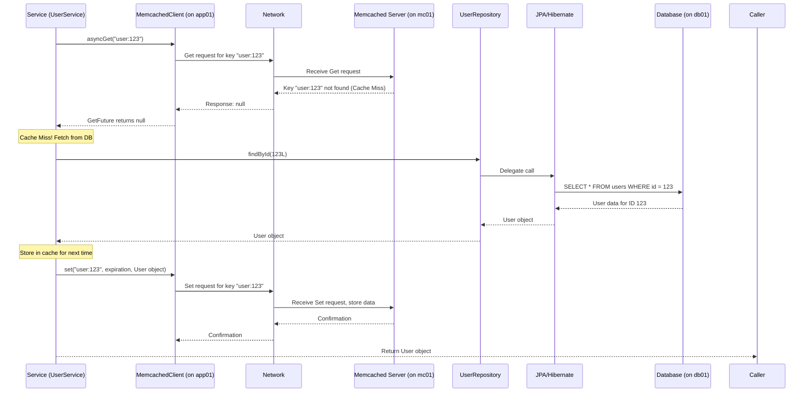
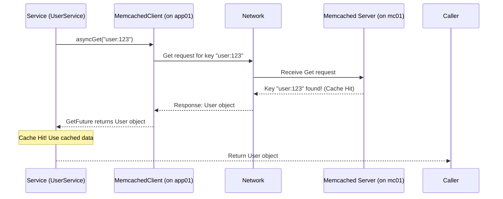

# Chapter 5: Caching Mechanism (Memcached)

Welcome back! In our last chapter, [Data Persistence Layer (JPA/Hibernate)](04_data_persistence_layer__jpa_hibernate__.md), we learned how the `vpro_project` stores and retrieves data from the MySQL database on the `db01` VM using JPA and Hibernate, simplified by Spring Data JPA. This is essential for making sure our data is saved long-term.

However, imagine you have certain pieces of data that are requested *very* frequently, but don't change often. For example, maybe user profile summaries, product catalog lists, or configuration settings. If every single request for this data has to go all the way to the database (`db01` VM), execute a query, and bring the data back to the application (`app01` VM), it can add noticeable delay, especially under heavy load. The database might become a bottleneck.

Think of the database as the main library archives. It has everything, but getting a specific book takes time (walking there, finding the section, checking it out). If a particular book is *extremely* popular, and many people ask for it repeatedly, sending each person to the main archives every time is inefficient.

**The problem:** How can we speed up access to frequently requested data and reduce the load on our primary database?

**The solution (for this project): A Caching Mechanism using Memcached.**

A **cache** is like a temporary, high-speed storage area that keeps copies of data that is likely to be needed again soon. Instead of going to the slow, main storage (the database) every time, the application first checks the faster, temporary storage (the cache).

## What is Memcached?

**Memcached** is a very popular, simple, in-memory caching system.
*   **In-memory:** It stores data directly in the computer's RAM (Random Access Memory), which is *much* faster than reading from a disk (where databases usually store data).
*   **Dedicated System:** Memcached runs as its own service, often on a separate server or virtual machine. In our Vagrant setup, it runs on the `mc01` VM.
*   **Simple Key-Value Store:** Memcached doesn't understand complex data structures or relationships like a database. It just stores data as simple pairs: a unique **key** (like a name or identifier) and the **value** (the data itself). Think of it like a giant shared dictionary or hash map that multiple applications can use.

Using Memcached is like setting up a "popular items" shelf near the front desk of the library. When someone asks for a popular book, the front desk clerk (our application) checks the shelf first. If it's there ("cache hit"), they grab it instantly. If not ("cache miss"), they go to the main archives (the database), get the book, *and* place a copy on the "popular items" shelf for the next person, before giving it to the current person.

## Key Concepts

| Concept         | What it is                                       | Role                                                              |
| :-------------- | :----------------------------------------------- | :---------------------------------------------------------------- |
| **Cache**       | A high-speed storage layer for temporary data.   | Reduces latency and database load.                                |
| **Memcached**   | The specific caching software used.              | Provides the dedicated in-memory storage service.                   |
| **Key**         | A unique string identifier for a piece of data.  | How you ask Memcached for a specific value (e.g., `"user:123"`).    |
| **Value**       | The data stored in the cache.                    | What Memcached returns when you provide a key (e.g., a User object). |
| **Cache Hit**   | Requesting data that IS found in the cache.      | Fast! Data is returned directly from Memcached.                   |
| **Cache Miss**  | Requesting data that is NOT found in the cache.  | Requires fetching data from the original source (database).       |
| **Expiration**  | A time limit for how long data stays in the cache. | Prevents outdated data from being served indefinitely.             |

## How it Works in `vpro_project`

In our Vagrant environment, as seen in the `Vagrantfile` ([Chapter 1](01_local_development_environment__vagrant__.md)):

```ruby
# ... other VM definitions ...

### Memcache vm  ####
  config.vm.define "mc01" do |mc01|
    mc01.vm.box = "centos/stream9" # Memcached runs on this OS
    mc01.vm.hostname = "mc01" # Hostname for the Memcached VM
    mc01.vm.network "private_network", ip: "192.168.56.14" # Private IP for Memcached
    mc01.vm.provider "virtualbox" do |vb|
     vb.memory = "600" # Allocated RAM for the VM (some for Memcached itself)
   end
  end

# ... other VM definitions ...
```
The `mc01` VM (`192.168.56.14`) is specifically set up to run the Memcached server software.

Our Java application code, running on the `app01` VM (`192.168.56.12`), needs a way to *talk* to the Memcached server on `mc01`. This is done using a **Memcached client library**. The `vpro_project` uses the `spymemcached` client library, as seen in the `pom.xml`:

```xml
        <!-- ... other dependencies ... -->
        <dependency>
            <groupId>net.spy</groupId>
            <artifactId>spymemcached</artifactId>
            <version>2.12.3</version> <!-- This is the Memcached client library -->
        </dependency>
        <!-- ... other dependencies ... -->
```
This dependency provides the Java code needed to connect to Memcached, set values, get values, and delete values.

The application code (typically within a Service or sometimes directly in a Repository, though Services are often preferred for this logic) will be modified to implement the **cache-aside pattern**:

1.  When data is needed, first try to `get` it from the cache using a specific `key`.
2.  If the data is found (`cache hit`), use it immediately.
3.  If the data is not found (`cache miss`), fetch it from the original source (the database).
4.  Once retrieved from the database, `set` it in the cache with the corresponding `key` and an **expiration time** so it's available quickly for subsequent requests.
5.  Return the data to the caller.

## Solving the Use Case: Caching User Data

Let's extend our `UserService` example from [Chapter 4](04_data_persistence_layer__jpa_hibernate__.md) to add caching for fetching a user by ID.

First, we need a Memcached client instance. Spring's Dependency Injection ([Chapter 3](03_core_application_framework__spring__.md)) would typically be used to configure and provide this client connection.

```java
import net.spy.memcached.MemcachedClient;
import java.io.IOException;
import java.net.InetSocketAddress;

// This setup code would likely be in a Spring @Configuration class
// and the MemcachedClient would be a Spring Bean.
// We show it here simplified for clarity.
public class MemcachedConfig {

    // Example: Connect to Memcached on mc01 (192.168.56.14) on default port 11211
    public MemcachedClient memcachedClient() throws IOException {
        MemcachedClient client = new MemcachedClient(
            new InetSocketAddress("mc01", 11211) // Connect to the mc01 VM
        );
        // You might add connection error handling here
        return client;
    }
}
```
This snippet shows conceptually how to connect using `spymemcached`. The actual configuration in `vpro_project` uses Spring to manage this connection as a bean. The connection details like "mc01" and "11211" are likely read from application configuration files.

Now, let's modify the `UserService` method `findUserById` to use this client:

```java
import com.satyam.vpro.model.User;
import com.satyam.vpro.repository.UserRepository;
import org.springframework.beans.factory.annotation.Autowired;
import org.springframework.stereotype.Service;
import org.springframework.transaction.annotation.Transactional;
import net.spy.memcached.MemcachedClient; // Import the Memcached client
import net.spy.memcached.internal.GetFuture; // For async get
import java.util.concurrent.TimeUnit; // For expiration time

@Service
public class UserService {

    @Autowired
    private UserRepository userRepository;

    @Autowired // Spring injects the configured MemcachedClient
    private MemcachedClient memcachedClient;

    // Cache expiration time (e.g., 5 minutes)
    private static final int CACHE_EXPIRATION_SECONDS = (int) TimeUnit.MINUTES.toSeconds(5);

    @Transactional(readOnly = true) // Still transactional for DB read if miss occurs
    public User findUserById(Long id) {
        // 1. Create a unique cache key for this user
        String cacheKey = "user:" + id; // e.g., "user:123"

        User user = null;

        try {
            // 2. Try to get the user from Memcached
            // Use async get for potentially better performance in real apps, get() waits.
            GetFuture<Object> futureUser = memcachedClient.asyncGet(cacheKey);
            Object cachedObject = futureUser.get(1, TimeUnit.SECONDS); // Wait up to 1 second for cache lookup

            if (cachedObject != null) {
                 // Cache Hit! Cast the retrieved object back to User
                user = (User) cachedObject;
                System.out.println("Cache Hit for key: " + cacheKey); // Log for demonstration
            } else {
                // Cache Miss! Need to fetch from the database
                System.out.println("Cache Miss for key: " + cacheKey + ". Fetching from DB."); // Log for demonstration
                user = userRepository.findById(id).orElse(null);

                // 4. If found in DB, store it in Memcached for next time
                if (user != null) {
                    // The set() method stores the key-value pair with an expiration time
                    memcachedClient.set(cacheKey, CACHE_EXPIRATION_SECONDS, user);
                    System.out.println("Stored in cache: " + cacheKey); // Log for demonstration
                }
            }
        } catch (Exception e) {
            // Handle exceptions (e.g., Memcached server down) gracefully
            System.err.println("Memcached error: " + e.getMessage() + ". Falling back to DB.");
            // In case of error, fall back to just fetching from DB
            user = userRepository.findById(id).orElse(null);
        }

        // 5. Return the user (either from cache or DB)
        return user;
    }

    // When a user is updated or deleted, you might need to invalidate the cache
    @Transactional // This method modifies the DB
    public User updateUser(User user) {
        // Save the user to the database
        User updatedUser = userRepository.save(user); // Hibernate handles the UPDATE

        // Invalidate the cache entry for this user because it's now outdated
        String cacheKey = "user:" + updatedUser.getId();
        memcachedClient.delete(cacheKey); // Remove the old data from cache
        System.out.println("Invalidated cache key: " + cacheKey); // Log

        return updatedUser;
    }
}
```
*   We define a `cacheKey` based on the data we are caching (e.g., `"user:123"`).
*   We use `memcachedClient.asyncGet(cacheKey)` (or `memcachedClient.get(cacheKey)`) to ask Memcached for the data.
*   If the result is not `null`, we got a cache hit! We use the cached data.
*   If the result is `null`, it's a cache miss. We go to the database using our `userRepository` ([Chapter 4](04_data_persistence_layer__jpa_hibernate__.md)).
*   If the user was found in the database, we use `memcachedClient.set(cacheKey, expirationTime, data)` to store it in Memcached for a specific duration (`CACHE_EXPIRATION_SECONDS`). Memcached automatically removes the data after this time.
*   We added a simple `updateUser` method to show the concept of **cache invalidation**. When the data changes in the database, the copy in the cache becomes stale ("dirty"). We must `delete` the corresponding entry from Memcached so the next request will correctly get the fresh data from the database and repopulate the cache.

This `findUserById` method now demonstrates the core cache-aside logic. The first time a user is requested, it's a cache miss, and the data comes from the database. Subsequent requests for the same user (within the expiration time) will likely be cache hits, providing much faster access.

## Under the Hood: Cache Interaction Flow

Let's trace the `findUserById(123L)` call in two scenarios: Cache Miss followed by Cache Hit.

**Scenario 1: Cache Miss**



**Scenario 2: Subsequent Request (Cache Hit)**



As you can see, in the cache hit scenario, the request never even goes to the database layer ([Chapter 4](04_data_persistence_layer__jpa_hibernate__.md)) because the data is retrieved directly from Memcached, which is much faster.

The application needs to know where the Memcached server is. This is configured in the application's settings (often using Spring properties) pointing to the `mc01` VM's IP address (`192.168.56.14`) and the standard Memcached port (11211). The `spymemcached` client uses these details to establish a network connection to the Memcached server on the `mc01` VM.

## Benefits of Caching

*   **Improved Performance:** Reduces response times for frequently accessed data.
*   **Reduced Database Load:** Takes pressure off the database server, allowing it to handle other tasks more efficiently.
*   **Increased Scalability:** Allows the application to handle more requests without needing to immediately scale the database vertically.

Caching is a powerful technique, but it adds complexity. You need to decide *what* to cache, *how long* it should live in the cache, and *how* to handle cache invalidation when the underlying data changes. Improper caching can lead to users seeing stale information.

## Conclusion

In this chapter, you learned about the **Caching Mechanism** in `vpro_project` using **Memcached**. You now understand why caching is important (speeding up data access, reducing database load) and how Memcached provides a dedicated, in-memory **key-value store** for this purpose on the `mc01` VM. You saw the concepts of **Cache Hit**, **Cache Miss**, and **Expiration**. You also learned how the application code, using a client library like `spymemcached`, implements the cache-aside pattern to check the cache before hitting the database and how **cache invalidation** is necessary when data changes.

Caching significantly boosts the performance of reading data. Next, we'll explore how the project handles tasks that don't need an immediate response or should happen in the background, using a messaging system.

[Next Chapter: Messaging Queue (RabbitMQ)](06_messaging_queue__rabbitmq__.md)

---

