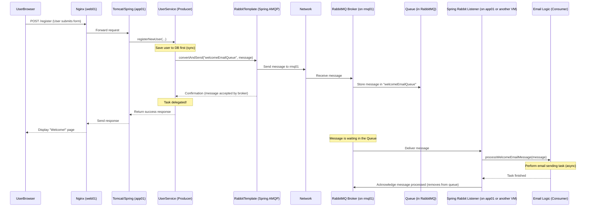

# Chapter 6: Messaging Queue (RabbitMQ)

Welcome back to the `vpro_project` tutorial! In the last chapter, [Caching Mechanism (Memcached)](05_caching_mechanism__memcached__.md), we learned how to speed up reading frequently accessed data by using Memcached on the `mc01` VM. Caching is great for making data retrieval faster, but what about tasks that take a little while to complete and don't need an immediate response shown to the user?

Imagine a user signs up on our website. They fill out a form, click "Register," and expect to see a "Welcome!" page right away. Behind the scenes, our application might also need to:
1.  Save their details to the database ([Data Persistence Layer (JPA/Hibernate)](04_data_persistence_layer__jpa_hibernate__.md)).
2.  Send them a welcome email.
3.  Update a counter of total registered users.
4.  Index their profile for searching ([Search Engine Integration (Elasticsearch)](07_search_engine_integration__elasticsearch__.md)).

Saving to the database should probably happen immediately so their account is created. But sending an email or indexing for search can take a few seconds or might even temporarily fail due to external services. If our application waits for *all* these tasks to finish *before* showing the "Welcome!" page, the user might stare at a loading screen for a long time. Worse, if the email server is down, the user might get an error page, even though their registration *did* succeed in the database!

**The problem:** How can our application trigger tasks that are time-consuming, potentially unreliable, or don't need an immediate response, without making the user wait or risking the failure of the main request?

**The solution (for this project): A Messaging Queue using RabbitMQ.**

A **Messaging Queue** is like a post office system for applications. Instead of one part of the application directly calling another part to perform a task (like "Hey, send this email right now!"), it writes a message (like "Send welcome email to user@example.com") and puts it into a queue. Another part of the application that's specifically designed to send emails constantly watches that queue, picks up the message when it's ready, and performs the task. The first part of the application can continue immediately after dropping the message into the queue.

RabbitMQ is the specific software that runs this post office system for us.

## What is RabbitMQ?

**RabbitMQ** is a popular **message broker**.
*   **Message Broker:** It's the middleman that receives messages from senders, routes them, stores them safely in queues, and delivers them to receivers.
*   **Dedicated System:** Like Memcached and MySQL, RabbitMQ runs as its own service, in our case on the `rmq01` VM.
*   **Asynchronous Communication:** The key benefit. When a sender sends a message, it doesn't wait for the receiver to process it. It just hands the message to RabbitMQ and moves on. The receiver processes the message *independently* later.

Using RabbitMQ is like writing a thank-you note and dropping it in a mailbox (the queue). You don't wait for the mail carrier to pick it up, drive it to the post office, sort it, deliver it, and wait for the recipient to read it *before* you go do something else. You just drop it and you're done with that step. The postal service (RabbitMQ) handles the rest. The recipient (the consumer) gets the letter when the postal service delivers it and reads it at their convenience.

## Key Concepts

| Concept          | What it is                                        | Role in `vpro_project` Use Case (Email)                |
| :--------------- | :------------------------------------------------ | :----------------------------------------------------- |
| **Producer**     | An application component that sends messages.     | The part of the registration code that sends "send email" message. |
| **Consumer**     | An application component that receives & processes messages. | A dedicated email sending service that listens for messages. |
| **Message**      | The data payload being sent.                      | Contains info like the recipient's email address and type of email (welcome). |
| **Queue**        | A waiting line for messages.                      | Where "send email" messages wait until a consumer is ready. |
| **Broker**       | The messaging server (RabbitMQ itself).           | Manages queues, receives from producers, delivers to consumers. |
| **Asynchronous** | Sender doesn't wait for receiver.                 | Registration completes quickly; email is sent in background. |

## How it Works in `vpro_project`

Looking at the `Vagrantfile` ([Chapter 1](01_local_development_environment__vagrant__.md)):

```ruby
# ... other VM definitions ...

### RabbitMQ vm  ####
  config.vm.define "rmq01" do |rmq01|
    rmq01.vm.box = "centos/stream9" # RabbitMQ runs on this OS
    rmq01.vm.hostname = "rmq01" # Hostname for the RabbitMQ VM
    rmq01.vm.network "private_network", ip: "192.168.56.13" # Private IP for RabbitMQ
    rmq01.vm.provider "virtualbox" do |vb|
     vb.memory = "600" # Allocated RAM for the VM
   end
  end

# ... other VM definitions ...
```
The `rmq01` VM (`192.168.56.13`) hosts the RabbitMQ server.

Our Java application on the `app01` VM needs to connect to RabbitMQ to send and receive messages. The project uses the **AMQP client library** and **Spring AMQP** (part of Spring Framework's messaging support) for this, as seen in `pom.xml`:

```xml
        <!-- ... other dependencies ... -->
        <dependency>
            <groupId>org.springframework.amqp</groupId>
            <artifactId>spring-rabbit</artifactId>
            <version>3.1.6</version> <!-- Spring integration for RabbitMQ -->
        </dependency>
        <dependency>
            <groupId>com.rabbitmq</groupId>
            <artifactId>amqp-client</artifactId>
            <version>5.21.0</version> <!-- The low-level RabbitMQ client -->
        </dependency>
        <dependency>
            <groupId>org.springframework</groupId>
            <artifactId>spring-messaging</artifactId>
            <version>${spring.version}</version> <!-- Core Spring Messaging support -->
        </dependency>
        <!-- ... other dependencies ... -->
```
*   `amqp-client`: The basic Java library to talk to RabbitMQ.
*   `spring-messaging`: Spring's general support for messaging.
*   `spring-rabbit`: Makes using the `amqp-client` much easier within a Spring application, handling configuration, sending messages using simple interfaces, and setting up message listeners (consumers).

## Solving the Use Case: Sending a Welcome Email Asynchronously

Let's use the welcome email example.
1.  When a user registers (perhaps handled by a `UserService` as seen in [Chapter 4](04_data_persistence_layer__jpa_hibernate__.md)), after saving to the database, we send a message to RabbitMQ.
2.  A separate component, maybe called `EmailService` or a dedicated `MessageListener`, is configured to listen to a specific queue in RabbitMQ.
3.  When a message arrives in that queue, the `EmailService` component picks it up and sends the actual email.

First, we need to configure the connection to RabbitMQ. This is typically done in a Spring configuration class, defining a `ConnectionFactory` and a `RabbitTemplate` (Spring's helper for sending messages).

```java
import org.springframework.amqp.rabbit.connection.ConnectionFactory;
import org.springframework.amqp.rabbit.core.RabbitTemplate;
import org.springframework.context.annotation.Bean;
import org.springframework.context.annotation.Configuration;
import org.springframework.amqp.core.Queue; // Represents a queue in RabbitMQ

@Configuration // Tells Spring this is a configuration class
public class RabbitMQConfig {

    // Configuration details (hostname, port, etc.) likely come from application properties
    // Example: rmq01 is hostname, 5672 is default RabbitMQ port
    private static final String RABBITMQ_HOST = "rmq01";
    private static final int RABBITMQ_PORT = 5672;
    private static final String WELCOME_EMAIL_QUEUE = "welcomeEmailQueue"; // Name of our queue

    // Spring helps configure the connection factory
    @Bean
    public ConnectionFactory rabbitConnectionFactory() {
        // Standard way to create a connection factory pointing to our RabbitMQ VM
        org.springframework.amqp.rabbit.connection.CachingConnectionFactory connectionFactory =
            new org.springframework.amqp.rabbit.connection.CachingConnectionFactory(RABBITMQ_HOST, RABBITMQ_PORT);
        // Configure username, password etc. if needed (often default for dev)
        // connectionFactory.setUsername(...);
        // connectionFactory.setPassword(...);
        return connectionFactory;
    }

    // RabbitTemplate makes sending messages easy
    @Bean
    public RabbitTemplate rabbitTemplate(ConnectionFactory connectionFactory) {
        RabbitTemplate template = new RabbitTemplate(connectionFactory);
        // Additional configuration might go here (e.g., message converters)
        return template;
    }

    // Define the queue in RabbitMQ. Spring can create it if it doesn't exist.
    @Bean
    public Queue welcomeEmailQueue() {
        return new Queue(WELCOME_EMAIL_QUEUE, true); // Queue name, durable (survives broker restart)
    }
}
```
This configures Spring to connect to the RabbitMQ server on `rmq01` and defines a queue named `"welcomeEmailQueue"`. Spring's `RabbitTemplate` bean will be used by producers to send messages.

Now, let's modify the `UserService` to send the message (Act as a Producer):

```java
import com.satyam.vpro.model.User;
import com.satyam.vpro.repository.UserRepository;
import org.springframework.beans.factory.annotation.Autowired;
import org.springframework.stereotype.Service;
import org.springframework.transaction.annotation.Transactional;
import org.springframework.amqp.rabbit.core.RabbitTemplate; // Import RabbitTemplate

@Service
public class UserService {

    @Autowired
    private UserRepository userRepository; // Database interaction

    @Autowired // Spring injects the configured RabbitTemplate
    private RabbitTemplate rabbitTemplate;

    // The name of the queue we want to send to (matches the Queue bean name)
    private static final String WELCOME_EMAIL_QUEUE = "welcomeEmailQueue";

    @Transactional // Still transactional for DB save
    public User registerNewUser(String username, String email) {
        User newUser = new User(username, email);
        User savedUser = userRepository.save(newUser); // Save to database immediately

        // Send a message to RabbitMQ to trigger email sending later
        try {
            // Create a message payload (could be User object, ID, or specific data)
            // For simplicity, let's send the user's email address and username
            String emailMessage = savedUser.getEmail() + "," + savedUser.getUsername();

            // Send the message to the specified queue using RabbitTemplate
            rabbitTemplate.convertAndSend(WELCOME_EMAIL_QUEUE, emailMessage);

            System.out.println("Sent message to RabbitMQ for welcome email for user: " + username); // Log

        } catch (Exception e) {
            // Log error, but don't fail the user registration request
            System.err.println("Failed to send welcome email message to RabbitMQ for user: " + username + ". Error: " + e.getMessage());
            // Consider adding retry logic or alerting here in a real app
        }

        // User registration is complete from the user's perspective
        return savedUser;
    }

    // ... other UserService methods like findUserById ...
}
```
In this updated `registerNewUser` method, after the user is successfully saved to the database, we use the injected `rabbitTemplate` to send a message (`emailMessage`) to the queue named `"welcomeEmailQueue"`. The `convertAndSend` method handles packaging the message and sending it to the RabbitMQ broker. The `UserService` method finishes immediately after sending the message; it doesn't wait for the email to actually be sent.

Next, we need a Consumer component (a Listener) that waits for messages on `"welcomeEmailQueue"` and processes them (Act as a Consumer):

```java
import org.springframework.amqp.rabbit.annotation.RabbitListener; // Annotation for listeners
import org.springframework.stereotype.Component;

@Component // Makes this a Spring-managed component
public class WelcomeEmailListener {

    // This method will automatically receive messages from "welcomeEmailQueue"
    @RabbitListener(queues = "welcomeEmailQueue")
    public void processWelcomeEmailMessage(String emailMessage) {
        System.out.println("Received welcome email message: " + emailMessage); // Log

        try {
            // Parse the message payload (e.g., "email@example.com,username")
            String[] parts = emailMessage.split(",");
            String recipientEmail = parts[0];
            String username = parts[1];

            // --- SIMULATE EMAIL SENDING ---
            System.out.println("Simulating sending welcome email to " + recipientEmail + " for user " + username + "...");
            // In a real application, you would call an actual email sending library/service here
            Thread.sleep(2000); // Simulate work time (e.g., 2 seconds)
            System.out.println("Email simulated sent successfully to " + recipientEmail);
            // --- END SIMULATION ---

        } catch (Exception e) {
            // Handle errors during processing (e.g., email service failed)
            System.err.println("Error processing welcome email message: " + emailMessage + ". Error: " + e.getMessage());
            // Depending on configuration, RabbitMQ might retry delivery automatically
        }
    }
}
```
*   `@Component`: Makes this class a Spring bean.
*   `@RabbitListener(queues = "welcomeEmailQueue")`: This powerful annotation tells Spring AMQP: "Make this method (`processWelcomeEmailMessage`) a listener for messages arriving in the queue named 'welcomeEmailQueue'". Spring AMQP automatically sets up the connection to RabbitMQ, waits for messages, receives them, and calls this method with the message payload.
*   The method parameter (`String emailMessage`) receives the message content sent by the producer.
*   Inside the method, we implement the logic to perform the task – in this case, simulating sending an email. This processing happens *independently* and *later* than the original `registerNewUser` call.

With this setup, when a user registers, the `UserService` quickly sends a message to RabbitMQ and returns the response to the user. Sometime later, the `WelcomeEmailListener` (which could be running on the same `app01` VM or even a different VM configured as a consumer) picks up the message from the queue and sends the email without blocking the user registration process.

## Under the Hood: Message Flow

Let's trace the asynchronous email sending process:


This diagram shows the main request path completes quickly after the message is sent to RabbitMQ. The message processing happens separately and later via the Listener.

The application on `app01` connects to the RabbitMQ server on `rmq01` using the hostname `rmq01` and the standard AMQP port 5672. Spring AMQP handles establishing and managing these connections, both for sending (Producer) and receiving (Consumer).

## Benefits of Messaging Queues

*   **Decoupling:** The sender (producer) doesn't need to know *who* will process the message or *how* they will do it. It just needs to know the queue name. The receiver (consumer) doesn't need to know *who* sent the message. This makes components more independent.
*   **Asynchronous Processing:** Long-running tasks don't block the main application flow, improving responsiveness.
*   **Buffering and Load Leveling:** RabbitMQ can store many messages in a queue if consumers are busy, preventing the producer from being slowed down. Consumers can process messages at their own pace.
*   **Reliability:** RabbitMQ can be configured to store messages persistently on disk (even if the server restarts) until they are successfully processed, ensuring tasks aren't lost.
*   **Scalability:** You can add more consumers to process messages from a queue in parallel, increasing throughput for background tasks.

Messaging queues are powerful for building applications where different parts need to communicate reliably without being directly dependent on each other's immediate availability.

## Conclusion

In this chapter, you learned about the **Messaging Queue (RabbitMQ)** in `vpro_project`. You now understand the concept of using a message broker to handle tasks **asynchronously** that don't require an immediate response, like sending emails after registration. You saw how RabbitMQ runs on the `rmq01` VM and acts as a middleman, storing messages in **Queues** sent by **Producers** and delivering them to **Consumers** (Listeners). You also saw how Spring AMQP and `spring-rabbit` make it easier to integrate message sending (`RabbitTemplate`) and receiving (`@RabbitListener`) into our Spring application code on the `app01` VM.

Using a messaging queue helps make the application more responsive, resilient, and scalable by handling background tasks separately from the main request flow.

Now that we've covered storing data persistently, speeding up reading data, and handling asynchronous tasks, the next chapter will explore another important aspect: making data quickly searchable.

[Next Chapter: Search Engine Integration (Elasticsearch)](07_search_engine_integration__elasticsearch__.md)

---

