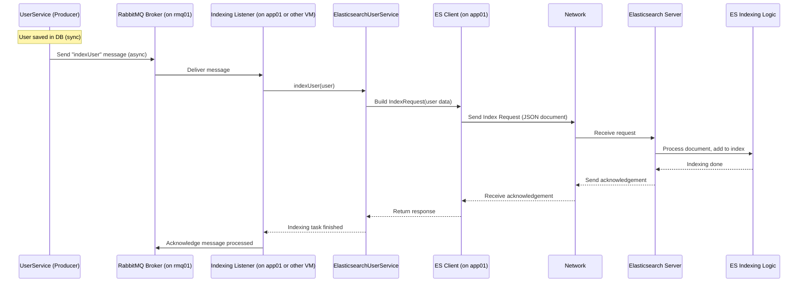
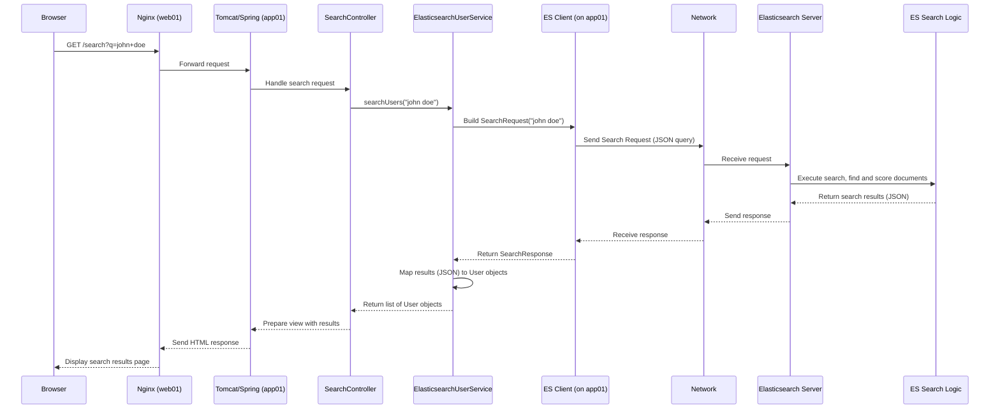

# Chapter 7: Search Engine Integration (Elasticsearch)

Welcome back to the `vpro_project` tutorial! In the last chapter, [Messaging Queue (RabbitMQ)](06_messaging_queue__rabbitmq__.md), we learned how to use a message queue to handle background tasks asynchronously, making our application more responsive by not blocking the user for things like sending emails.

Now, let's talk about finding information within our application. Imagine you want to find a user based on parts of their username or profile description. A traditional database query (like `SELECT * FROM users WHERE username LIKE '%search_term%'`) can be slow, especially on large amounts of text data. It's also not great at handling misspellings, finding synonyms, or ranking results by how relevant they are. You just get exact or partial matches based on simple patterns.

Think about searching for a book in a huge library. If all you had was a giant list of every word in every book and its location, finding a specific book or topic would be impossible! You need a proper index and a search system that understands what you're *really* looking for, even if you don't type the exact words perfectly.

**The problem:** How can we provide fast, flexible, and relevant full-text search capabilities across large amounts of data in our application, going beyond the limitations of standard database queries?

**The solution (for this project): Search Engine Integration using Elasticsearch.**

**Elasticsearch** is a powerful, specialized tool built specifically for searching and analyzing large volumes of data quickly. It's designed to handle text search, filter data efficiently, and provide relevant results, unlike a traditional database which is optimized for structured storage and transactions. It's like having a dedicated, super-fast, and smart librarian who keeps a detailed index of *everything* and can find what you need almost instantly.

## What is Elasticsearch?

**Elasticsearch** is a distributed, open-source search and analytics engine.
*   **Distributed:** It can run across multiple servers, allowing it to handle massive amounts of data and traffic, and providing high availability.
*   **Search and Analytics:** While great for searching, it can also be used for analyzing data (like counting how many documents match a query).
*   **Optimized for Text Search:** It uses techniques like indexing, tokenization (breaking text into words), and relevance scoring to provide much better search results than a database.

In our `vpro_project` environment, Elasticsearch runs as a separate service that our application (on the `app01` VM) communicates with.

## Key Concepts

Let's look at the fundamental building blocks in Elasticsearch relevant to our project:

| Concept       | Analogy                                  | What it is in Elasticsearch Context                      |
| :------------ | :--------------------------------------- | :------------------------------------------------------- |
| **Data**      | A book in the library                    | A **Document** - the basic unit of information (e.g., a user's profile data). |
| **Collection**| A section in the library (e.g., "Fiction") | An **Index** - a collection of documents that share similar characteristics (e.g., an "users" index). |
| **Indexing**  | Creating the book's index or library's card catalog | The process of adding a Document to an Index, making its content searchable. |
| **Searching** | Looking up a book in the catalog or asking the librarian | Sending a **Query** to an Index to find relevant Documents. |
| **Mapping**   | Defining the structure of the card catalog entry (Author, Title, Subject) | Defining how fields within a Document are stored and indexed for searching. |

In essence, you take data from your database ([Chapter 4](04_data_persistence_layer__jpa_hibernate__.md)), convert it into **Documents**, and add (or **Index**) them into specific **Indices** in Elasticsearch. When a user searches, your application sends a **Query** to the relevant Elasticsearch Index, and Elasticsearch returns the matching **Documents** quickly.

## How it Works in `vpro_project`

Our Java application running on the `app01` VM needs to interact with the Elasticsearch server. Similar to how we connected to Memcached ([Chapter 5](05_caching_mechanism__memcached__.md)) and RabbitMQ ([Chapter 6](06_messaging_queue__rabbitmq__.md)), the application uses a client library to communicate over the network.

The `pom.xml` file shows the dependency for interacting with Elasticsearch:

```xml
        <!-- ... other dependencies ... -->
        <dependency>
            <groupId>org.elasticsearch.client</groupId>
            <artifactId>elasticsearch-rest-high-level-client</artifactId>
            <version>7.10.2</version> <!-- The Elasticsearch client library -->
        </dependency>
        <dependency>
            <groupId>org.elasticsearch</groupId>
            <artifactId>elasticsearch</artifactId>
            <version>7.10.2</version> <!-- Core Elasticsearch types -->
        </dependency>
        <!-- ... other dependencies ... -->
```
The `elasticsearch-rest-high-level-client` is a Java library that provides a convenient way to send requests (like indexing documents or running searches) to an Elasticsearch server using its REST API.

The interaction with Elasticsearch involves two main processes within our application:

1.  **Indexing:** When data is created, updated, or deleted in the primary database (MySQL on `db01`), the application needs to send the corresponding changes to Elasticsearch so the search index stays up-to-date. This is crucial for search results to reflect the latest data. This indexing process is often triggered after a successful database write. As discussed in [Chapter 6](06_messaging_mechanism__rabbitmq__.md), sending a message to RabbitMQ to trigger asynchronous indexing is a good pattern for this.
2.  **Searching:** When a user performs a search query via the application's interface (handled by a Spring MVC Controller, [Chapter 3](03_core_application_framework__spring__.md)), the application sends this query to Elasticsearch. Elasticsearch processes the query, finds matching documents, ranks them by relevance, and sends back the results. The application then presents these results to the user.

## Solving the Use Case: Making Users Searchable

Let's imagine we want to allow users to search for other users by their username or email.

First, we need to configure the `ElasticsearchClient` in our Spring application (on `app01`) so we can inject and use it. This involves specifying the address of the Elasticsearch server.

```java
import org.apache.http.HttpHost;
import org.elasticsearch.client.RestClient;
import org.elasticsearch.client.RestHighLevelClient;
import org.springframework.context.annotation.Bean;
import org.springframework.context.annotation.Configuration;

@Configuration // Tells Spring this is a configuration class
public class ElasticsearchConfig {

    // Configuration details (hostname, port) likely from application properties
    // Example: es01 is hostname (conceptual), 9200 is default HTTP port
    private static final String ELASTICSEARCH_HOST = "es01"; // Assume a hostname for ES
    private static final int ELASTICSEARCH_PORT = 9200;
    private static final String ELASTICSEARCH_PROTOCOL = "http";

    // Spring Bean for the high-level Elasticsearch client
    @Bean(destroyMethod = "close") // Ensure client is closed when application stops
    public RestHighLevelClient elasticsearchClient() {
        RestHighLevelClient client = new RestHighLevelClient(
            RestClient.builder(
                new HttpHost(ELASTICSEARCH_HOST, ELASTICSEARCH_PORT, ELASTICSEARCH_PROTOCOL)
                // Add more hosts here if running a cluster
            )
        );
        // You might add authentication or other configurations here
        System.out.println("Connecting to Elasticsearch at " + ELASTICSEARCH_HOST + ":" + ELASTICSEARCH_PORT);
        return client;
    }

    // Although not always needed for simple use, you might define index names
    // as constants or beans for better management.
    public static final String USERS_INDEX = "users";
}
```
This configuration sets up a `RestHighLevelClient` bean that the rest of our application can use to talk to Elasticsearch. The `ELASTICSEARCH_HOST` would be the hostname or IP address of the VM or server where Elasticsearch is running.

Next, we need a component to handle the indexing and searching logic, perhaps an `ElasticsearchUserService`. This component will use the injected `RestHighLevelClient`.

Let's look at simplified methods for indexing and searching users.

**1. Indexing a User Document:**

When a `User` object is saved or updated in the database ([Chapter 4](04_data_persistence_layer__jpa_hibernate__.md)), we need to send it to Elasticsearch.

```java
import com.fasterxml.jackson.databind.ObjectMapper; // Needed to convert Java objects to JSON
import org.elasticsearch.action.index.IndexRequest;
import org.elasticsearch.action.index.IndexResponse;
import org.elasticsearch.client.RequestOptions;
import org.elasticsearch.client.RestHighLevelClient;
import org.elasticsearch.common.xcontent.XContentType;
import org.springframework.beans.factory.annotation.Autowired;
import org.springframework.stereotype.Service;

// Assume this service is called *after* a user is saved/updated in the DB
// It might be triggered by a RabbitMQ message (see Chapter 6)
@Service // Makes this a Spring-managed component
public class ElasticsearchUserService {

    @Autowired // Spring injects the configured Elasticsearch client
    private RestHighLevelClient elasticsearchClient;

    private final ObjectMapper objectMapper = new ObjectMapper(); // Helper for JSON conversion

    // Assume User class exists with getId(), getUsername(), getEmail()
    // It might also have other fields like getFullName(), getDescription() etc.

    public void indexUser(User user) {
        if (user == null || user.getId() == null) {
            System.err.println("Cannot index null user or user with null ID.");
            return;
        }

        try {
            // 1. Define the Index Request
            IndexRequest request = new IndexRequest(ElasticsearchConfig.USERS_INDEX); // Specify the target index ("users")
            request.id(user.getId().toString()); // Use the database ID as the Elasticsearch document ID

            // 2. Convert the User object to JSON, which is the format Elasticsearch uses
            String userJson = objectMapper.writeValueAsString(user);
            request.source(userJson, XContentType.JSON); // Set the document source as JSON

            // 3. Execute the Index Request
            IndexResponse indexResponse = elasticsearchClient.index(request, RequestOptions.DEFAULT);

            System.out.println("Indexed user ID " + user.getId() + " with result: " + indexResponse.getResult()); // Log success
            // Result will be CREATED or UPDATED

        } catch (Exception e) {
            System.err.println("Error indexing user ID " + user.getId() + ": " + e.getMessage());
            // Handle error (e.g., log, retry)
        }
    }

    // You would also need a method to delete a document from ES when a user is deleted from the DB
    public void deleteUserDocument(Long userId) {
         // Similar structure using DeleteRequest
         // elasticsearchClient.delete(new DeleteRequest(ElasticsearchConfig.USERS_INDEX, userId.toString()), RequestOptions.DEFAULT);
         // ... error handling ...
    }
}
```
*   We inject the `RestHighLevelClient`.
*   We create an `IndexRequest`, specifying the target **Index** (`"users"`) and a unique **ID** for the **Document** (using the user's database ID).
*   We convert the Java `User` object into a JSON string, as Elasticsearch works with JSON documents. `ObjectMapper` from the Jackson library (also in `pom.xml`) is a common way to do this.
*   We set the JSON string as the source for the request.
*   We execute the request using `elasticsearchClient.index()`. This sends the data over the network to Elasticsearch for indexing.

**2. Searching for Users:**

When a user types a query (e.g., "john doe") into a search box, our application receives this, and a Controller calls a method like `searchUsers` in our `ElasticsearchUserService`.

```java
import org.elasticsearch.action.search.SearchRequest;
import org.elasticsearch.action.search.SearchResponse;
import org.elasticsearch.client.RequestOptions;
import org.elasticsearch.client.RestHighLevelClient;
import org.elasticsearch.index.query.QueryBuilders; // Helper for building queries
import org.elasticsearch.search.SearchHit; // Represents a single search result
import org.elasticsearch.search.builder.SearchSourceBuilder; // Builds the search query body
import org.springframework.beans.factory.annotation.Autowired;
import org.springframework.stereotype.Service;

import java.util.ArrayList;
import java.util.List;

@Service // Makes this a Spring-managed component
public class ElasticsearchUserService {

    // ... Autowired client and ObjectMapper from above ...
    @Autowired
    private RestHighLevelClient elasticsearchClient;
    private final ObjectMapper objectMapper = new ObjectMapper();


    // Assume User class exists with appropriate constructor/setters for mapping from JSON

    public List<User> searchUsers(String queryText) {
        List<User> searchResults = new ArrayList<>();
        if (queryText == null || queryText.trim().isEmpty()) {
            return searchResults; // Return empty list for empty query
        }

        try {
            // 1. Define the Search Request
            SearchRequest searchRequest = new SearchRequest(ElasticsearchConfig.USERS_INDEX); // Search in the "users" index

            // 2. Build the Search Query using SearchSourceBuilder
            SearchSourceBuilder sourceBuilder = new SearchSourceBuilder();

            // Create a query: MultiMatchQuery searches across multiple fields
            // This query will look for the queryText in 'username', 'email', and maybe 'description' fields
            sourceBuilder.query(QueryBuilders.multiMatchQuery(queryText, "username", "email", "description")); // Search query logic

            sourceBuilder.size(10); // Set the number of results to return (e.g., top 10)
            // You can add sorting, pagination, highlighting etc. here

            searchRequest.source(sourceBuilder); // Set the built query body for the search request

            // 3. Execute the Search Request
            SearchResponse searchResponse = elasticsearchClient.search(searchRequest, RequestOptions.DEFAULT);

            // 4. Process the Search Response and extract results
            for (SearchHit hit : searchResponse.getHits().getHits()) {
                // Each hit is a matching document
                String sourceAsString = hit.getSourceAsString(); // Get the document source as JSON string
                // Convert the JSON string back to a User object
                User user = objectMapper.readValue(sourceAsString, User.class);
                // You might set relevance score (hit.getScore()) on the user object if needed
                searchResults.add(user);
                 System.out.println("Found user: " + user.getUsername() + " (ID: " + user.getId() + ", Score: " + hit.getScore() + ")"); // Log
            }

            System.out.println("Search for '" + queryText + "' found " + searchResults.size() + " results."); // Log total hits

        } catch (Exception e) {
            System.err.println("Error during Elasticsearch search for '" + queryText + "': " + e.getMessage());
            // Handle error (e.g., return empty list, show error message)
            // In a real app, this might fall back to a less effective DB search as a last resort
        }

        return searchResults;
    }

    // ... other methods ...
}
```
*   We create a `SearchRequest` targeting the `"users"` index.
*   We use `SearchSourceBuilder` and `QueryBuilders` helpers to define the specific search logic. `multiMatchQuery` is used here to search the `queryText` across multiple fields (`username`, `email`, etc.) in the documents. Elasticsearch handles the text analysis and scoring automatically.
*   We set the query body on the `searchRequest`.
*   We execute the request using `elasticsearchClient.search()`. This sends the query to Elasticsearch.
*   Elasticsearch returns a `SearchResponse` containing `SearchHit` objects. Each `hit` represents a matching document.
*   We iterate through the `hits`, get the original JSON document (`getSourceAsString`), convert it back to a `User` object using `ObjectMapper`, and add it to our results list. The `hit.getScore()` gives you the relevance score calculated by Elasticsearch.

These examples show the basic pattern: configure the client, then use `IndexRequest` to add data and `SearchRequest` with a `QueryBuilder` to find data.

## Under the Hood: Elasticsearch Interaction Flow

Let's trace the indexing and searching processes at a high level.

**Scenario 1: Indexing a User (after DB save)**


The indexing is typically an asynchronous background task triggered after the primary data change in the database to avoid slowing down the main application flow.

**Scenario 2: Searching for Users**


The search process is typically synchronous from the user's perspective – they wait for the results page. The speed comes from Elasticsearch's dedicated search capabilities.

The application needs to know the network location of the Elasticsearch server to establish the connection. This is configured (e.g., `es01:9200`), usually via application properties managed by Spring. The `RestHighLevelClient` handles the network communication details.

## Benefits of Elasticsearch Integration

*   **Fast Full-Text Search:** Highly optimized for searching large text fields quickly.
*   **Relevant Results:** Provides sophisticated scoring to return the most relevant documents first.
*   **Flexibility:** Supports complex queries, filtering, faceting (like showing counts by category), and handling variations in text (typos, synonyms).
*   **Scalability:** Can be scaled horizontally to handle more data and search requests.
*   **Reduced Database Load:** Offloads complex search queries from the primary database, allowing it to focus on transactional operations.

Integrating a search engine like Elasticsearch adds significant power to the application's ability to find information, providing a much better user experience for search features compared to relying solely on database lookups.

## Conclusion

In this chapter, you've learned about **Search Engine Integration** in `vpro_project` using **Elasticsearch**. You now understand why a dedicated search engine is needed for fast and relevant full-text search beyond what a traditional database provides. You saw that Elasticsearch stores data as **Documents** within **Indices** and uses **Indexing** to prepare data for quick searching and **Queries** to retrieve relevant results. You also learned how the application on `app01` uses the `elasticsearch-rest-high-level-client` to index data (often asynchronously) and execute searches against the Elasticsearch server, enabling powerful search features within the application.

This concludes our exploration of the key components and concepts in the `vpro_project` architecture. You've now seen how the project sets up its environment, handles web requests, structures its core logic, persists data, uses caching for speed, leverages messaging queues for asynchronous tasks, and integrates a search engine for advanced search capabilities.

You now have a foundational understanding of the major pieces that make up this project!

---
This is the final chapter in the described structure. No link to a next chapter is needed.

---

