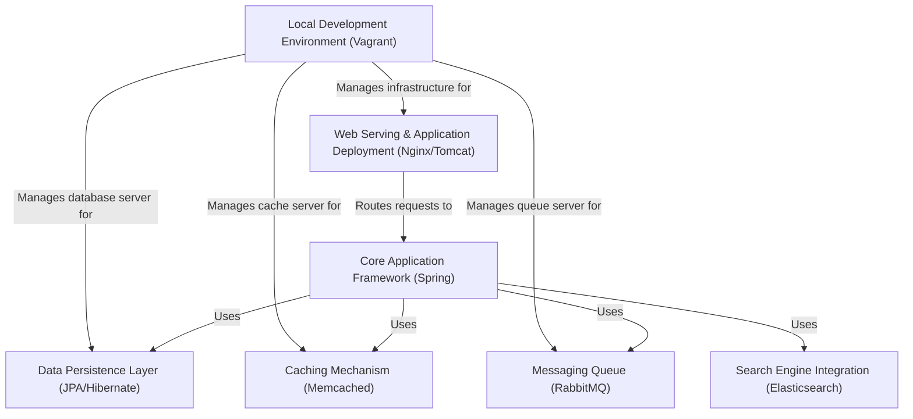

# Prerequisites

- JDK 17 or 21
- Maven 3.9
- MySQL 8

# Technologies 
- Spring MVC
- Spring Security
- Spring Data JPA
- Maven
- JSP
- Tomcat
- MySQL
- Memcached
- Rabbitmq
- ElasticSearch
# Database
Here,we used Mysql DB 
sql dump file:
- /src/main/resources/db_backup.sql
- db_backup.sql file is a mysql dump file.we have to import this dump to mysql db server
- > mysql -u <user_name> -p accounts < db_backup.sql

# Tutorial: vpro_project

This project, named VProfile, is a web application built using the **Spring framework**. It manages and stores data using **JPA** and a **MySQL** database.
For performance, it utilizes **Memcached** for caching and **Elasticsearch** for fast searching. Background tasks and inter-component communication are handled asynchronously via **RabbitMQ** messaging.
The entire multi-component system (web server, app server, database, cache, message queue) is set up for local development using **Vagrant**.

## Visual Overview

## Chapters

1. [Local Development Environment (Vagrant)
](01_local_development_environment__vagrant__.md)
2. [Web Serving & Application Deployment (Nginx/Tomcat)
](02_web_serving___application_deployment__nginx_tomcat__.md)
3. [Core Application Framework (Spring)
](03_core_application_framework__spring__.md)
4. [Data Persistence Layer (JPA/Hibernate)
](04_data_persistence_layer__jpa_hibernate__.md)
5. [Caching Mechanism (Memcached)
](05_caching_mechanism__memcached__.md)
6. [Messaging Queue (RabbitMQ)
](06_messaging_queue__rabbitmq__.md)
7. [Search Engine Integration (Elasticsearch)
](07_search_engine_integration__elasticsearch__.md)

---
