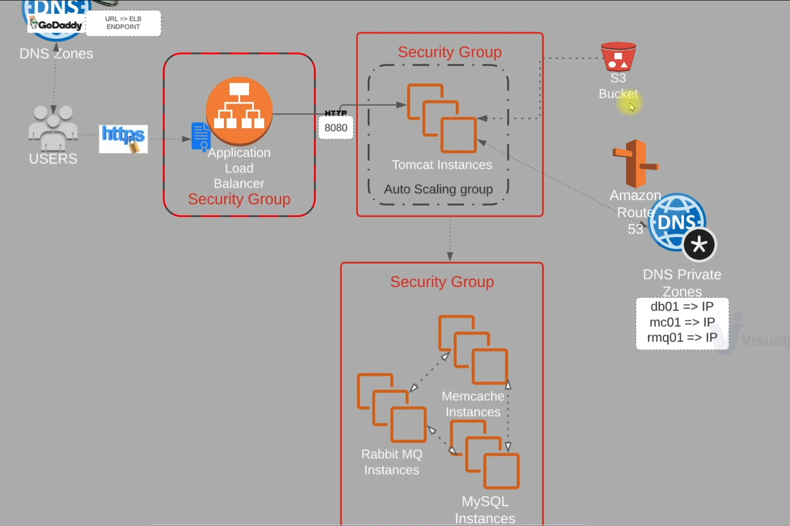
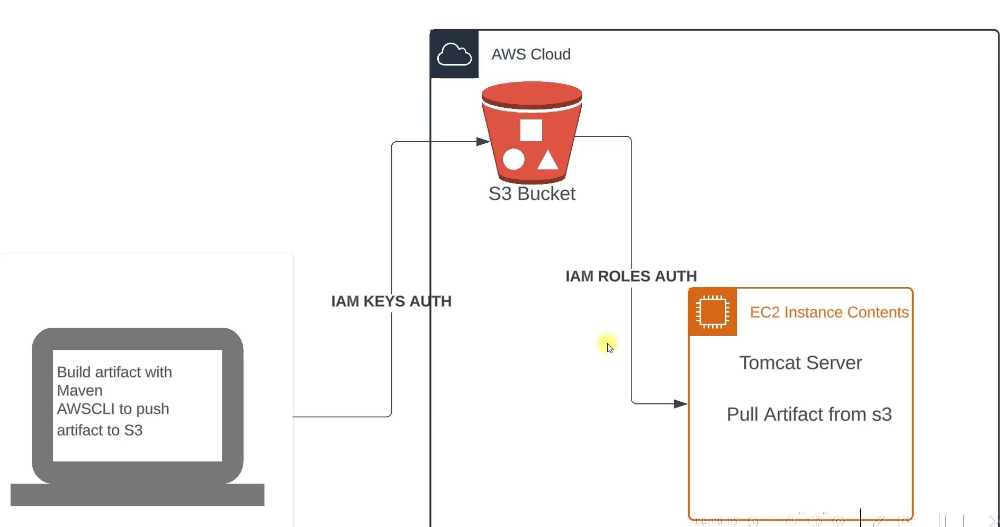

# VPRO_ Project AWS Lift and Shift:

# Prerequisites

- JDK 11 
- Maven 3 
- MySQL 8

# Technologies 
- Spring MVC
- Spring Security
- Spring Data JPA
- Maven
- JSP
- Tomcat
- MySQL
- Memcached
- Rabbitmq
- ElasticSearch
# Database
Here,we used Mysql DB 
sql dump file:
- /src/main/resources/db_backup.sql
- db_backup.sql file is a mysql dump file.we have to import this dump to mysql db server
- ` mysql -u <user_name> -p accounts < db_backup.sql`

# Architecture 

1)	EC2 Instances
2)	ELB (Elastic Load Balancer)
3) 	AutoScaling Group
4)	Amazon S3 - for Artifacts of mavan
5) 	Amazon Certificate Manager (ACM)
6)	Route 53

<figure>

<figcaption><b>
Architecture Diagram
</b></figcaption>  
</figure>

# FLOW OF EXECUTION

-   Login to AWS Account

-   Create Key Pairs

-   Create Security Groups

-   Launch EC2 Instances with User Data [Bash Scripts]

-   Update IP to name mapping in Route53

-   Build Application from Source Code

-   Upload to S3 Bucket 

-   Download Artifacts to Tomcat Ec2 Instance 

-   Setup ELB with HTTPS [Cert from Amazon Certificate Manager(ACM)]

-   Map ELB Endpoint to website name in Godaddy DNS

 

# 1) Create Key Pairs:
 

-   Login To AWS Account 

-   EC2 > Network & Security > Key Pairs

-   Create Key Pair > name > Key Pair Type > Private Key file Format

-   .pem(Windows), .ppk(Linux) > Create Key Pair

 

# 2) Create Security Groups:
 

-   Create 3 Security Groups:

    -   Load balancer SG
    -   Tomcat SG
    -   Backend SG

>   Load Balancer Security Group (ELB) will allow HTTP & HTTPS Traffic on Port 80 & 443 for both IPV4 & IPV6 allowed from anywhere

>   Tomcat Security Group listens on port 8080 on traffic coming from ELB. port 22 for allowing SSH from MyIP, Tomcat connects with 3 backend services:

-   MySQL(3306). Memcache(11211), RabbitMQ(5672)

>   Backend Security Group will allow above 3 port Traffic from Tomcat Security Group also port 22 for SSH from MyIP

 

>   ELB Security Group:

 

-   EC2 > Network & Security > Security Groups > Create security group

-   Security group name (vpro-elb-sg)

-   Edit inbound rules: 
    
    -   Type > HTTP > Anywhere IPV4
    -   Type > HTTP > Anywhere IPV6
    -   Type > HTTPS > Anywhere IPV4
    -   Type > HTTPS > Anywhere IPV6

-   Create Security group

 

>   Tomcat(App) Security Group:

 

-   EC2 > Network & Security > Security Groups > Create security group

-   Security group name (vpro-app-sg)

-   Edit inbound rules: 

    -   Type > Custom TCP > Port Range > 8080 > Source > vpro-elb-sg
    -   Type > SSH > Source > My IP
-   Create Security group

 

>   Backend Security Group:

 

-   EC2 > Network & Security > Security Groups > Create security group

-   Security group name (vpro-backend-sg)

-   Edit inbound rules:

    -   Type > MYSQL/Aurora > Source > vpro-app-sg
    -   Type > Custom TCP > Port Range > 11211 > Source > vpro-app-sg
    -   Type > Custom TCP > Port Range > 5672 > Source > vpro-app-sg
    -   Type > SSH > Source > My IP
    -   Type > All traffic > Source > vpro-app-sg
-   Create Security group

 

>   Note: After creating vpro-backend-sg security group, add one more inbound rule to allow All traffic from vpro-backend-sg itself.

 

# 3) Launch EC2 Instances with User Data [Bash Scripts]

 

-   We are going to Setup 4 EC2 Instances:

    -   <b> MySQL Instance</b>
    -   <b> Memcache Instance</b>
    -   <b> RabbitMQ Instance</b>
    -   <b> Tomcat Instance</b>

-   MySQL , MemCache, RabbitMQ Goes to <b>vpro-backend-sg</b> security group.

-   Tomcat Instance goes to <b>vpro-app-sg</b> security group.

 

>   MySQL Instance:

-   EC2 > Instances > Launch instances

    -   Name: vpro-db01
    -   AMI: Amazon Linux
    -   Amazon Linux(Free Tier)
    -   Instance Type: t2.micro
    -   Key pair (login) : Select the key pair name 
    -   Network settings > Firewall (security groups) > Select existing security group > Common security groups > <b>vpro-backend-sg</b>
    -   Advanced details > User data > paste the <b>mysql.sh</b> script file from userdata > Launch instance.

 

>   Memcache Instance:

-   EC2 > Instances > Launch instances

    -   Name: vpro-mc01
    -   AMI: Amazon Linux
    -   Amazon Linux(Free Tier)
    -   Instance Type: t2.micro
    -   Key pair (login) : Select the key pair name 
    -   Network settings > Firewall (security groups) > Select existing security group > Common security groups > <b>vpro-backend-sg</b>
    -   Advanced details > User data > paste the <b>memcache.sh</b> script file from userdata > Launch instance.

 

>   RabbitMQ Instance:

-   EC2 > Instances > Launch instances

    -   Name: vpro-rmq01
    -   AMI: Amazon Linux
    -   Amazon Linux(Free Tier)
    -   Instance Type: t2.micro
    -   Key pair (login) : Select the key pair name 
    -   Network settings > Firewall (security groups) > Select existing security group > Common security groups > <b>vpro-backend-sg</b>
    -   Advanced details > User data > paste the <b>rabbitmq.sh</b> script file from userdata > Launch instance.

 

>   Tomcat Instance:

-   EC2 > Instances > Launch instances

    -   Name: vpro-app01
    -   AMI: Ubuntu
    -   Ubuntu Server 24.04 LTS(Free Tier)
    -   Instance Type: t2.micro
    -   Key pair (login) : Select the key pair name 
    -   Network settings > Firewall (security groups) > Select existing security group > Common security groups > <b>vpro-app-sg</b>
    -   Advanced details > User data > paste the <b>tomcat_ubuntu.sh</b> script file from userdata > Launch instance.

 

> Services Verification in Instance:

-   EC2 > Instances > vpro-db01 > copy public IPv4 address

    -   open git bash/Terminal  
    -   `ssh -i /path/keypair.pem ec2-user@PublicIP`
    -   `systemctl status mariadb | grep active`
    -   `mysql -u root -padmin123 accounts;`

 

-   EC2 > Instances > vpro-mc01 > copy public IPv4 address

    -   open git bash/Terminal
    -   `ssh -i /path/keypair.pem ec2-user@PublicIP`
    -   `systemctl status memcached | grep active`

 

-   EC2 > Instances > vpro-rmq01 > copy public IPv4 address

    -   open git bash/Terminal
    -   `ssh -i /path/keypair.pem ec2-user@PublicIP`
    -   `systemctl status rabbitmq-server | grep active`

 

# 4) Update IP to name mapping in Route53

-   repo/src/resources/application.properties: contains the hostname and other properties which was getting resolved in local system using /etc/hostname

-   in cloud requires private DNS service that can resolve name to ip for the instances.

>   Create a Hosted zone in Route53

-   Route 53 > Create hosted zone > Domain name > vprofile.in > Type > Private hosted zone > Region > US East (N. Virginia) > VPC > Default > Create hosted zone

>   Add the Private IP addresses of the instances in route53 and create the records

-   EC2 > Instances > vpro-db01 > copy private ip > Route 53 > Hosted zones > vprofile.in > Create record > Record name > db01 > Record Type > A > Value > Paste the IP > Create records

-   EC2 > Instances > vpro-mc01 > copy private ip > Route 53 > Hosted zones > vprofile.in > Create record > Record name > mc01 > Record Type > A > Value > Paste the IP > Create records

-   EC2 > Instances > vpro-rmq01 > copy private ip > Route 53 > Hosted zones > vprofile.in > Create record > Record name > rmq01 > Record Type > A > Value > Paste the IP > Create records

-   EC2 > Instances > vpro-app01 > copy private ip > Route 53 > Hosted zones > vprofile.in > Create record > Record name > app01 > Record Type > A > Value > Paste the IP > Create records

>   Verify if Rout53 is resolving the name to ip:

-   EC2 > Instances > vpro-app01 > copy public ip > `ssh -i public_key ubuntu@public_ip` > `ping -c 4 db01.vprofile.in`

 

# 5) Build and Deploy Artifacts in S3

 

<figure>

<figcaption><b>
Architecture Diagram
</b></figcaption>  
</figure>

 

-   Building Artifacts locally using maven

    -   Requires JDK & Maven

-   Pushing Artifacts to AWS S3 

    -   Requires AWS CLI & S3 Bucket creation

-   To move Artifacts from local to S3 bucket requires IAM Auth Key for the user

-   To Download the Artifacts from S3 to Tomcat instance Requires IAM Role 

>   Create S3 Bucket to Store the Artifacts:

-   Amazon S3 > Buckets > Create bucket > Bucket name > vpro-las-artifactnew > Create bucket

>   Create a user for S3 Admin

-   IAM > Users > Create user > User name > vpro-s3-admin > next > Attach policies directly > AmazonS3FullAccess > next > Create user

-   IAM > Users > vpro-s3-admin > security credentials > Create access key > CLI > next > create access key > copy access key and secret.

>   Create a Role for instances:

-   IAM > Roles > Create role > AWS service > Use case (EC2) > next > Permissions policies > AmazonS3FullAccess > next > Role name > vpro-s3-admin-role > Create role

>   Attach the Role to app01 (Tomcat) instance

-   EC2 > Instances > vpro-app01 > Actions > Security > Modify IAM role > vpro-s3-admin-role > Update IAM role

>   Update the repo/src/resources/application.properties file with the record names created in route 53

>   Build the Artifact using Maven

-   cd repo/src > mvn install

-   it will create a target folder - vpro-v2.war

>   Copy the Artifacts to S3 bucket

-   open Git bash/Terminal

    -   `aws configure`
    -   `AWS Access Key ID [None]:` provide the access key id
    -   `AWS Secret Access Key [None]:` provide the secret key id
    -   `Default region name [us-east-1]:` provide the default region
    -   `Default output format [json]:` json

-   Credentials are stored in : ~/.aws/credentials

-   `aws s3 cp target/vpro-v2.war s3://vpro-las-artifactnew/`

-   list the bucket contents: `aws s3 ls s3://vpro-las-artifactnew/`

>   Download the Artifacts from S3 to Tomcat instance

-   Get the Public ip of app01 instance:

    -   EC2 > instances > vpro-app01 > public IPv4 address > copy
    -   open git bash/Terminal
    -   `ssh -i keypair.pem ubuntu@publicip`
    -   `sudo -i`
    -   `snap install aws-cli --classic`
    -   `aws s3 cp s3://vpro-las-artifactnew/vpro-v2.war /tmp`
    -   `systemctl stop tomcat10`
    -   `systemctl damon-reload`
    -   `systemctl stop tomcat10`
    -   `rm -rf /var/lib/tomcat10/webapps/`
    -   `cp /tmp/vpro-v2.war /var/lib/tomcat10/webapps/ROOT.war`
    -   `systemctl start tomcat10`

 

# 6) Setup ELB with HTTPS [Cert from Amazon Certificate Manager(ACM)]

 

>   Create a Target Group for load balancer

-   EC2 > Target groups > Create target group > target type > instances > Target group name > vpro-app-tg > Protocol Port > 8080 > Advance health check > Health check port > override > 8080 > next > Register targets > vpro-app01 > include as pending below > Create target group

>   Create Load balancer

-   Load balancer is listening on port 80(HTTP) & port 443(HTTPS)

-   Create a Certificate from ACM for secured connection

    -   ACM > Request a certificate > Certificate type > Public > next > type the domain name(ex: *.satyamtripathi.xyz) > Validation > DNS > Request

-   Add CNAME name and CNAME value record in your domain registrar

    -   Godaddy > Domain > DNS > Add New Record > Type > CNAME > copy the cname from certificate,remove the domain from end > value > paste the value and remove the . from the end > save

-   EC2 > Load balancers > Create load balancer > Application load balancer  > name > vpro-elb > network mapping > select all Availablity zone and subnets > Security groups > vpro-elb-sg > Listeners and routing > Default action > vpro-app-tg > add another listener for HTTPS and map the Target group > Secure listener settings > Certificate from ACM > select the certificate > Create load balancer

-   Add the load balancer DNS name in domain Registrar

    -   copy the DNS name from load balancer > Godaddy > Domain > DNS > Add New Record > name > vproapp > value > paste the dns name > Save

>   To access the secure connection site: https://vproapp.satyamtripathi.xyz

 

# 7) Create Auto Scaling Group for the Application instance

>   Create an AMI of app01 instance also the launch template (Security group, Key pairs) used during launch of new instance.

-   AMI Creation

    -   EC2 > Instances > vpro-app01 > Actions > Image and templates > Create image > image name > vpro-app-tomcat > Create image

-   Launch Template Creation

    -   EC2 > Launch Templates > Create launch template > name > vpro-app01-asg-lt > AMI > vpro-app-tomcat > Type > t2.micro > Key pair > select the key pair > Security group existing > vpro-app-sg > Create launch template

>   Create AutoScaling 

-   EC2 > Auto Scaling Groups > Create Auto Scaling group > name > vpro-app01-asg > launch template > vpro-app01-asg-lt > next > network > select all AZ's > next > Attach to an existing load balancer > Choose from load balancer target group > vpro-app-tg > Health checks > Turn on Elastic Load Balancing health checks > next > Desired cap > 1 > Min cap > 1 > max cap > 4 > Automatic scaling > Target Tracking > cpu 50 % > next > notifications > next > Create Scaling Group
